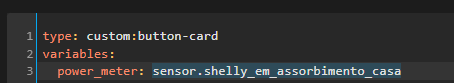
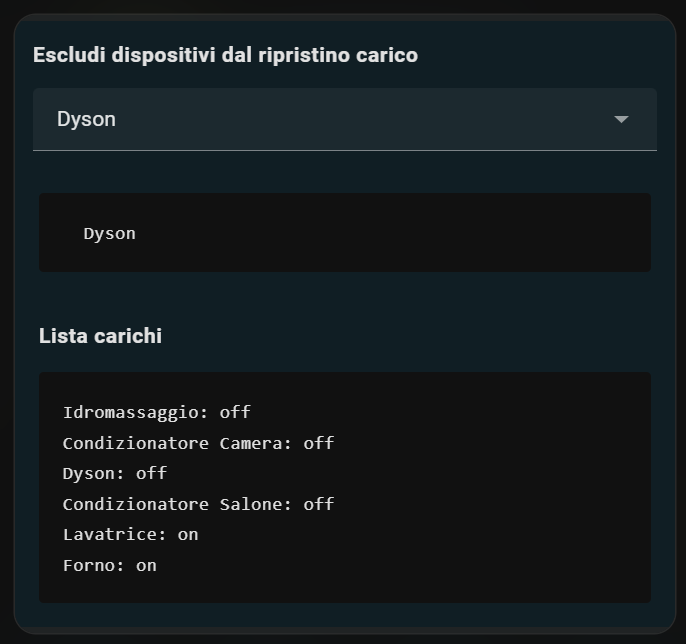
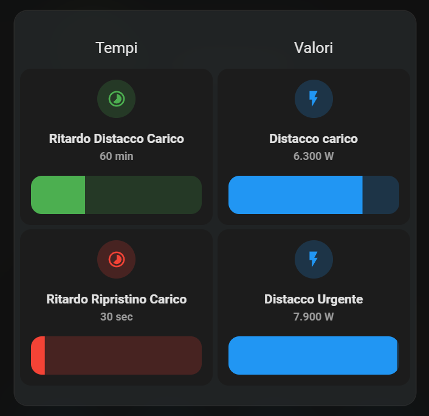

# Power-Control

`- Version: 1.3 -`

The package was written in Italian, but can be easily translated. As for the translation of the README, we relied on automatic translators and apologize for any translation errors.


The power control is a system that allows for the efficient management of electrical power, preventing overloads and power interruptions. Its main objective is to regulate energy consumption by shutting down devices based on the required power, thereby avoiding exceeding set limits and ensuring the stability of the electrical system. Additionally, the system is capable of reactivating previously shut down devices when consumption returns to normal.

<https://github.com/Home-Assistant-Pro-Team/Power-Control/assets/62516592/9c10e918-f4c3-4458-83e7-35cc3fe0f49f>

It is important to have a clear understanding of how electrical supply works in most cases. Let's take, for example, a 3 kW contract: the actual available power will be 3.3 kW, which includes a 10% reserve to manage any consumption peaks. However, it is possible to temporarily use a higher power with a tolerance of 33%, which amounts to 3,990 W, for a maximum of 180 minutes. During this period, three checks are carried out to verify compliance with the power limits.

| Potenza  | Effettiva | Tolleranza 33% |
| -------- | --------- | -------------- |
| 3.0 kW   | 3.3 kW    | 3990 W         |
| 4.5 kW   | 4.9 kW    | 5980 W         |
| 6.0 kW   | 6.6 kW    | 7980 W         |


Now, with these clear insights in mind, we can properly configure the power control package. What makes this package unique is its versatility: the devices that can be included in the control list may belong to different domains, such as switch, light, fan, climate, media_player, etc. There are no limits to the number of devices that can be added to the list.

During the device control process, specific checks are performed to determine if a device is actually in use. It is verified whether the device has a power consumption sensor (device_class power), and if so, whether the consumption exceeds the threshold of 15 W. This check helps identify if the device is actually drawing power. In the case where a device does not have a power consumption sensor, only the device's state is considered to determine if it is on or off.

The system operates as follows: two minutes before reaching the set threshold for power disconnection, a high consumption warning notification is sent to allow for manual management by the user. After the two minutes have elapsed and if the consumption remains high, the devices are sequentially turned off from the list, with a 20-second interval between each. During each shutdown phase, a notification is sent to keep the user informed about the process status. In the event that the consumption remains high but no devices are found to be on in the list, a notification is sent to alert the user of the occurrence.

If the emergency threshold is exceeded, the system acts immediately without considering the elapsed time. If an active device is detected, the devices are sequentially turned off.

Once the energy consumption falls below the preset disconnection threshold for the specified time, the system initiates the restoration process. The devices are reactivated in reverse order from the sequence in which they were turned off, taking into account the power consumption they had when they were turned off, with notifications sent to inform the user about the restoration status. Specific devices can be excluded from the restoration by selecting them through a dedicated selection menu. At the end of the restoration process, a final notification is sent to confirm that all devices have been successfully reactivated and that the energy consumption has returned to normal.

NB:

- The push notifications will be sent only to the people who are currently at home
- The package does not take into account the power consumption status in the case of 'multiswitch' devices, e.g., Shelly 4PM.

### **Requirements packages**
- [HomeAssitant release 2024.3 ](https://rc.home-assistant.io/blog/2024/03/06/release-20243/)
- [Cartella Package abilitata](https://www.home-assistant.io/docs/configuration/packages/)
- The device for general household consumption control is the Shelly EM.

### **Installation:**
For installation, you need to load the "custom_templates" folder in the "conf" directory of Home Assistant. If the folder already exists, you only need to copy the files into it.

- **personal.jinja**

    This file will be used for other projects within this GitHub repository. In the file, we set up personal data that will be used in all projects. Simply enter your entities respecting the JSON indentation.

	Let's see how to customize it. Although not all information is required for this package, it is advisable to fill in all fields to take full advantage of it in other projects.

	In this section, we define the entities and sensors for each person. If you do not want to associate a cell phone number or an alarm sensor with a specific person, simply assign the value "none" in the corresponding section of the file. To add or remove people from the dictionary list, you need to pay attention to the JSON syntax.

	```
	
	[
		{
			"person": "person.marco",
			"battery": "sensor.cellulare_marco_battery_level",
			"notify": "mobile_app_cellulare_marco",
			"sveglia": "sensor.cellulare_marco_prossimo_allarme",
			"cellulare": "331000000"
		},
		{
			"person": "person.serena",
			"battery": "sensor.cellulare_serena_livello_della_batteria",
			"notify": "mobile_app_samsung_s21",
			"sveglia": "none",
			"cellulare": "335000000"
		}
	]
	
	```
    In this section, we will list our media players used for notifications. Be sure to correctly enter the selected media players for Alexa and TTS notifications (e.g., Google), carefully following the correct syntax.

	```
	
		
		
			{{ integrations }}
		
	
	```

- **power_control.jinja**

    In this file, simply enter your entities of the devices you wish to turn off, in order of priority sequence. The first device in the list will be the first to be turned off (if turned on), followed by the second device, and so on.

	```
		
	```

	In addition, it is necessary to insert the sensor that measures the instantaneous general household absorption, expressed in watts (W).


	```
	
		{
			"Sensore W": "sensor.shelly_em_assorbimento_casa"
		}
	
	```

At this point, you can upload the folder [power_control](packages/power_control) and the file [entities_generali](packages/entities_generali.yaml) into the 'packages' directory and restart Home Assistant.

### **Card:**

#### **Requirements card:**

- Power sensor (W) included in the [recorder](https://www.home-assistant.io/integrations/recorder/)
- [Browser mode](https://github.com/thomasloven/hass-browser_mod) 
- [Button card](https://github.com/custom-cards/button-card)
- [Card Mod](https://github.com/thomasloven/lovelace-card-mod)
- [Apexcharts card](https://github.com/RomRider/apexcharts-card)
- [Mushroom](https://github.com/piitaya/lovelace-mushroom)


#### **Installation card:**
To use the card, we need to follow some simple steps. We start by creating a new manual card and copy the contents of the file "[card.txt](card.txt)" and enter the power sensor used previously in the power_meter variable.



#### **Explanation card:**
It is possible to turn load control on or off by pressing the button.

	


The card has 4 buttons at the bottom, each of which has a specific function. Below is the order and description of each button:


1) In the popup you can exclude devices from load restoration: This option allows you to specify one or more devices to be excluded from automatic load restoration. In other words, the selected devices will not be automatically turned back on after an interruption for load shedding. In addition, the devices entered in load control are displayed.




2) Questo popup viene utilizzato per configurare diverse impostazioni relative al sistema di gestione dei carichi. Ecco una spiegazione più dettagliata delle opzioni disponibili:

	- Ritardo Distacco Carico:  Load Detachment Delay: This option allows you to specify a waiting time, expressed in minutes, after which load detachment will be initiated. When the specified time elapses, the system will start disconnecting the connected devices.

	- Distacco carico: This setting requires a value, expressed in watts (W), which is the threshold above which the system will perform the disconnection of appliances. If the total power of the loads exceeds this value, the system will initiate the disconnection of the devices.

	- Ripristino Carico: This option allows you to set a value expressed in watts (W), which is the threshold below which devices will be automatically reactivated. The system will start the reactivation process of the previously deactivated devices with an interval of 20 seconds between each reactivation, provided that the instantaneous absorption is less than the set value.

	- Distacco Urgente:  This value should be higher than "Load Detachment" and allows the last appliance in the list to be turned off immediately if it is turned on within 30 seconds. On the other hand, if the last appliance is not turned on within this time interval, the order of the list for detaching the other loads will be respected.




3) This option enables push notifications that will be sent only to people in the home.

4) This function enables notifications for alexa media players and TTS (e.g., Google)

### **Contributions**
This project is open for contributions. If you would like to provide feedback, report a bug, or request a new feature, please create an issue on the repository.


### **Support us**
If you enjoyed this project, we would love to have your support. Even a simple coffee can make a difference. 
The funds raised will be used to purchase new equipment and carry out new projects. You can contribute by clicking on the button below. 
Thank you very much for your support!

[](https://ko-fi.com/M4M1MI00I)

### **Changelog**

#### **Version: 1.3:**

	- Removed two (non-blocking) errors from the log that were appearing when HomeAssistant was starting up
		```

			
			
			
				.................


			
				{{ now() > as_datetime(state_attr('timer.distacco_carico', 'finishes_at')) - timedelta(minutes=2) }}
			
				False
			
		```
	- The logic of restarting loads has been modified. Now, instead of relying only on the disconnection threshold, a reactivation threshold has been added to avoid unwanted continuous cycling. In addition, a fixed time of 20 seconds has been set for power-up between loads.

#### **Version: 1.5:**

- Solved the 255-character limit for the list of devices to be turned off.
- Modified macro template
- Added recovery and restoration of volume for Alexa and Google.
- Fixed issue preventing exclusion of devices from load restoration.
- Changed sensor.marquee_power_control.
- Changed power variable used by the automation.
- Added entities_generali.yaml file containing entities used in all packages of this GitHub repository.

#### **Version: 2.0:**

- Modified the macro template, now based on a dict.
- Removed the function that turned off devices turned on in the last 30 seconds.
- Added power consumption control for individual devices (where power data is available) before restoring the device.
- Modified most of the templates.
- Restored the date for sensor.marquee_power_control.
- Updated the list of loads in the card, now including power consumption where available.
- Fixed a bug that caused malfunctioning of the package in the presence of multiswitch devices, such as the Shelly 4PM. However, for these devices, actual power consumption is not currently considered.
- Added time range for notifications via media_player (default setting: 9-22).
- Modified push notification messages. Now notifications include the tag and display all used appliances.
- To update, replace the files: notify_media_control_power.yaml, control_power.yaml, power_control.jinja, and card.txt
